<div align="center">

# 📊 Data Analysis & AI Insight Platform

**Multi-format exploratory data analysis with AI-powered insights, advanced research labs, and professional visualizations – all in a single lightweight Flask application.**

[](https://www.python.org/downloads/)
[](https://flask.palletsprojects.com/)
[](LICENSE)

</div>

---

## 📋 Table of Contents
- [Overview](#-overview)
- [Screenshots & Features](#-screenshots--features)
- [Key Features](#-key-features)
- [Tech Stack](#%EF%B8%8F-tech-stack)
- [Quick Start](#-quick-start)
- [Research Labs](#-research-labs)
- [AI Integration](#-ai-integration)
- [Supported File Types](#-supported-file-types)
- [Development](#-development)
- [Roadmap](#%EF%B8%8F-roadmap)
- [Contributing](#-contributing)

---

## 🎯 Overview

What started as a simple CSV analysis tool has evolved into a comprehensive data insight platform combining traditional statistical analysis with cutting-edge AI capabilities and specialized research laboratories.

**Core Capabilities:**
- 📂 Multi-format data ingestion (CSV, Excel, JSON, TXT)
- 🤖 AI-powered summaries and interactive Q&A (Google Gemini)
- 📊 Professional static and interactive visualizations
- 🔬 Specialized research labs (forecasting, anomaly detection, quality assessment)
- 🎨 Light/Dark theme support
- ⚡ Performance-optimized caching and downsampling

### 🖼️ Application Interface

<div align="center">
  <table>
    <tr>
      <td align="center">
        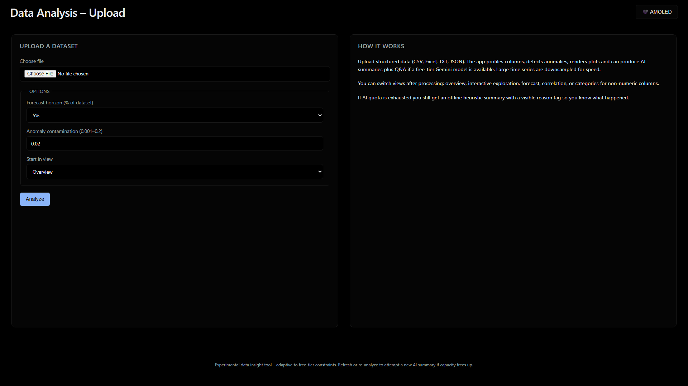
        <br/><em>Upload Interface (Light Theme)</em>
      </td>
      <td align="center">
        
        <br/><em>Upload Interface (Dark Theme)</em>
      </td>
    </tr>
  </table>
  <p><em>Clean, intuitive upload interface with configurable analysis options and theme support</em></p>
</div>

---

## 📸 Screenshots & Features

### 🤖 AI-Powered Analysis

<div align="center">
  <table>
    <tr>
      <td align="center">
        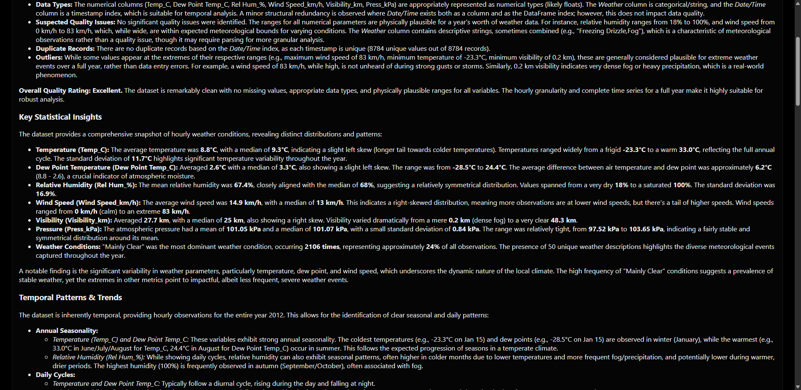
        <br/><em>AI Summary (Light Theme)</em>
      </td>
      <td align="center">
        
        <br/><em>AI Summary (Dark Theme)</em>
      </td>
    </tr>
  </table>
  <p><em>Comprehensive AI-generated narrative analysis with structured insights, data quality assessment, and actionable recommendations</em></p>
</div>

<div align="center">
  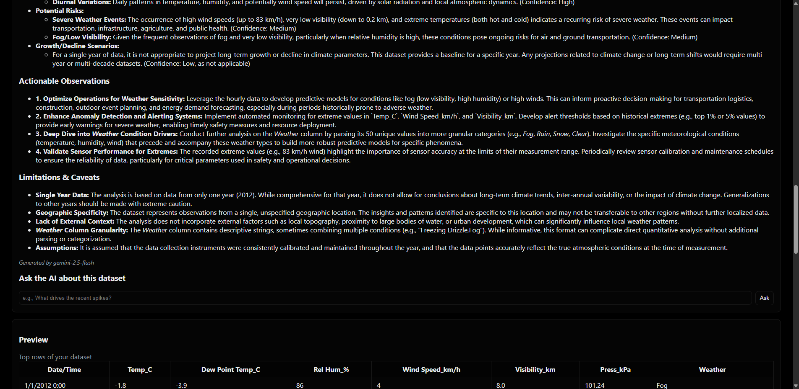
  <p><em>Interactive AI Q&A: Ask questions about your dataset and get contextual answers powered by Gemini</em></p>
</div>

### 📊 Visualizations & Statistical Analysis

<div align="center">
  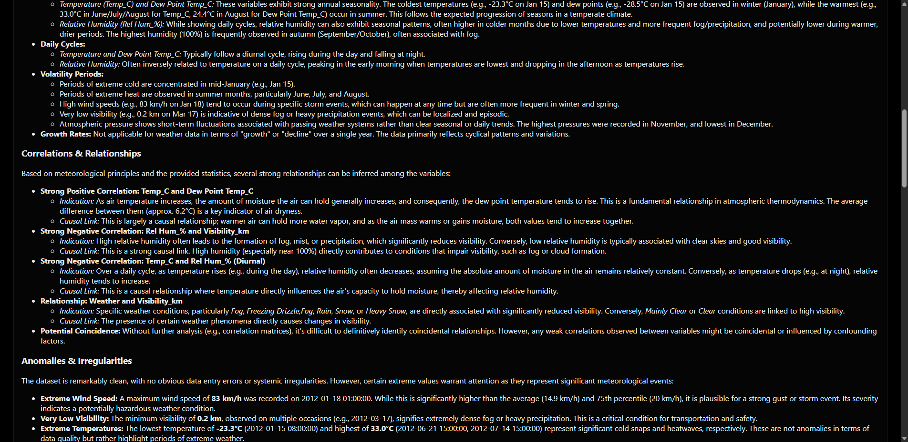
  <p><em>Comprehensive statistical analysis with descriptive statistics, distributions, and key metrics</em></p>
</div>

<div align="center">
  <table>
    <tr>
      <td align="center">
        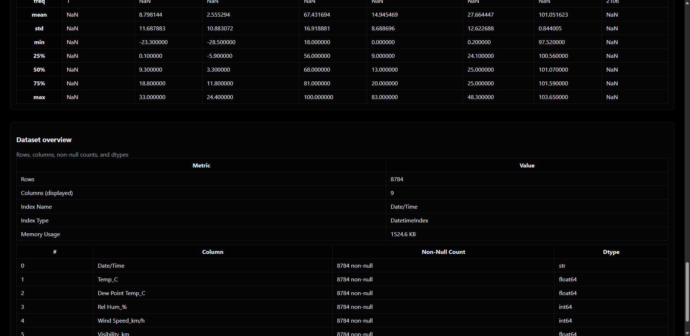
        <br/><em>High-quality Matplotlib static visualizations</em>
      </td>
      <td align="center">
        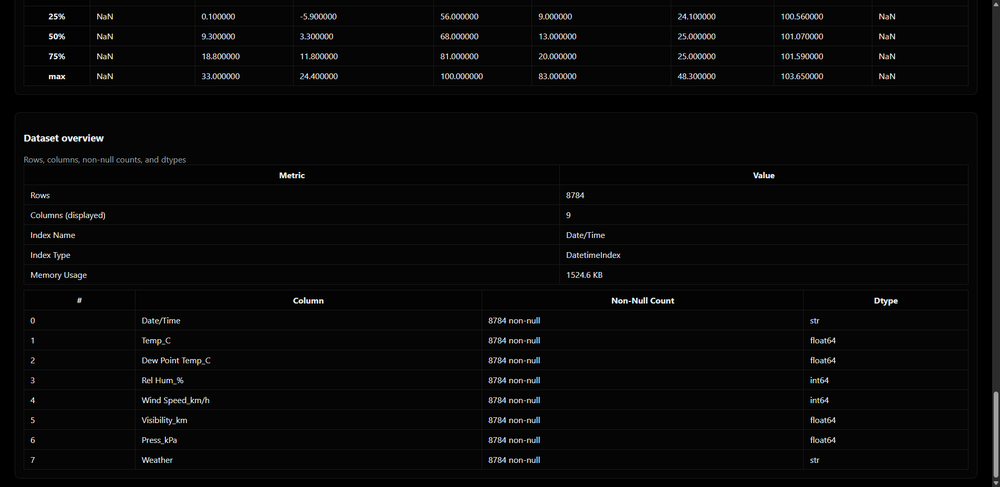
        <br/><em>Interactive Plotly charts</em>
      </td>
    </tr>
  </table>
  <p><em>Professional visualizations: static plots for reports, interactive charts for exploration</em></p>
</div>

### 🔬 Research Labs

<div align="center">
  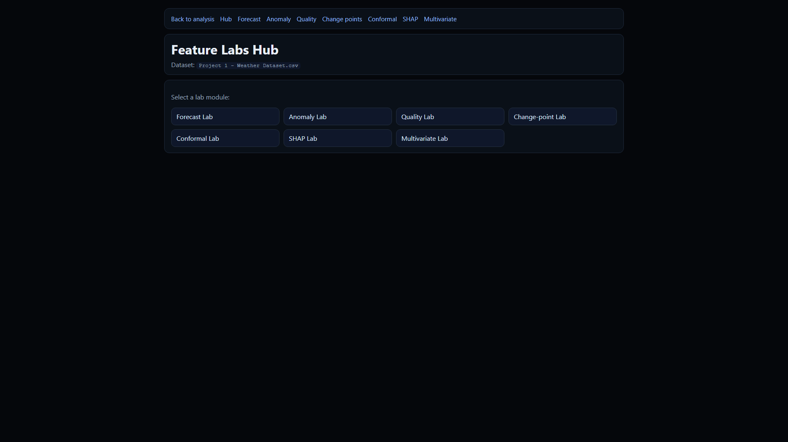
  <p><em>Research Feature Labs Hub: Access specialized analysis tools and advanced techniques</em></p>
</div>

<div align="center">
  <table>
    <tr>
      <td align="center">
        
        <br/><em>Time Series Forecasting</em>
      </td>
      <td align="center">
        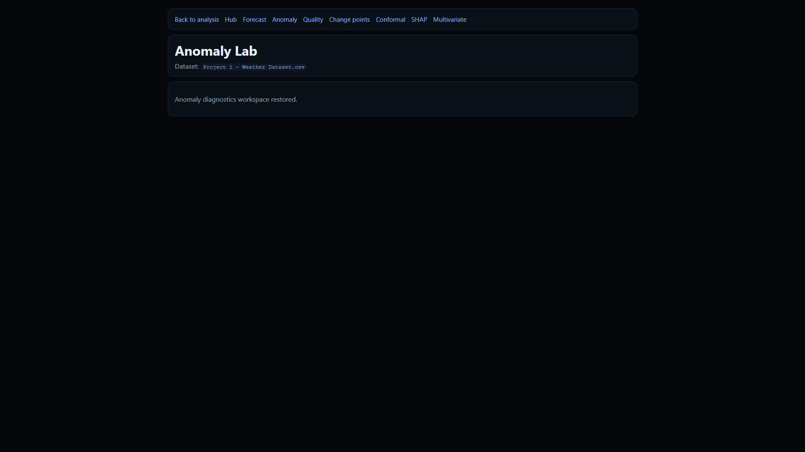
        <br/><em>Anomaly Detection</em>
      </td>
    </tr>
    <tr>
      <td align="center">
        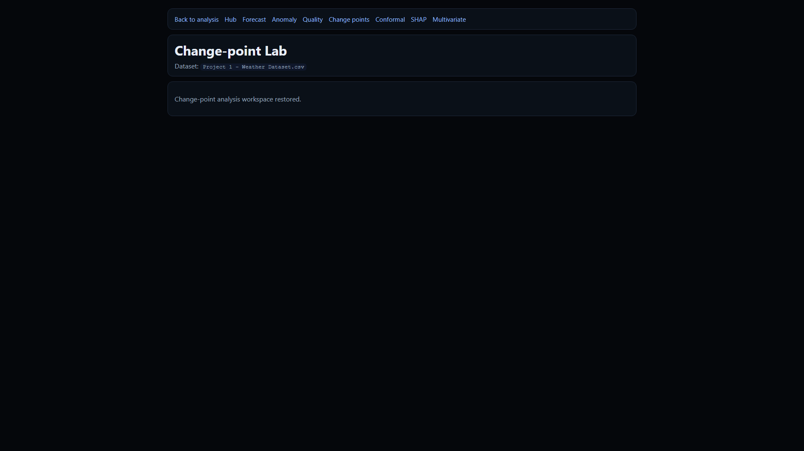
        <br/><em>Change Point Detection</em>
      </td>
      <td align="center">
        
        <br/><em>Multivariate Analysis</em>
      </td>
    </tr>
  </table>
  <p><em>Advanced research labs for forecasting, anomaly detection, change points, and multivariate analysis</em></p>
</div>

### 🌍 Multi-Dataset Support

<div align="center">
  <table>
    <tr>
      <td align="center">
        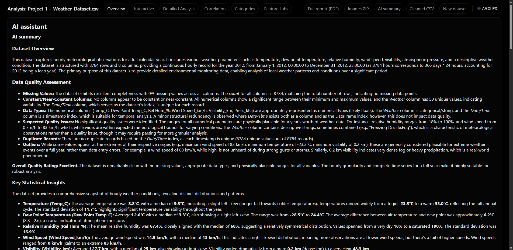
        <br/><em>Weather Dataset Analysis</em>
      </td>
      <td align="center">
        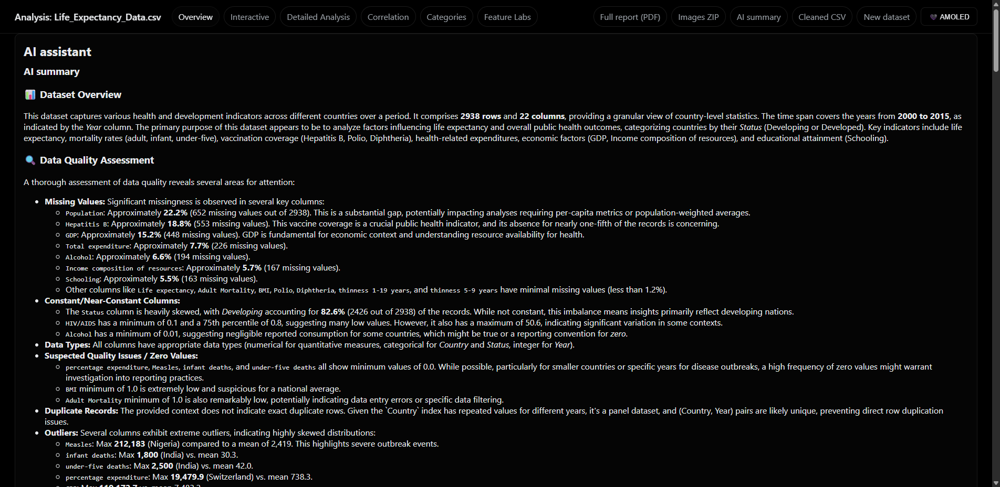
        <br/><em>Life Expectancy Analysis</em>
      </td>
    </tr>
  </table>
  <p><em>Versatile analysis engine handles diverse datasets: time series, health data, and more</em></p>
</div>

---

## ✨ Key Features

### Currently Implemented

**📂 Data Management**
- File upload & persistent session dataset registry (multiple datasets retained per run)
- Automatic schema parsing & numeric coercion with graceful fallbacks
- Support for CSV, Excel, JSON, and TXT formats
- Intelligent encoding detection for diverse file sources
- Session-based caching with LRU eviction

**📊 Statistical Analysis**
- Descriptive statistics (central tendency, dispersion, inferred types)
- Distribution analysis and data profiling
- Time series handling with automatic downsampling for large datasets
- Correlation analysis (Spearman & Pearson methods)
- Data quality assessment and missing value detection

**📈 Visualizations**
- Static Matplotlib plots (base64-encoded PNGs, no JS dependency)
- Interactive Plotly charts for deep exploration
- Time series plots with trend analysis
- Correlation heatmaps
- Distribution histograms and box plots

**🤖 AI Integration (Google Gemini)**
- Multi-section narrative summaries with structured insights
- Interactive Q&A: Ask contextual questions about datasets
- Intelligent caching to reduce API rate pressure
- Adaptive model fallback (auto-downgrades when quota exhausted)
- Offline fallback summaries when AI unavailable
- Rate limit-aware backoff with error surfacing in UI

**🔬 Research Labs** *(Specialized analysis modules)*
- **Time Series Forecasting**: STL decomposition, prediction with confidence intervals
- **Anomaly Detection**: Statistical outlier identification
- **Data Quality Assessment**: Completeness, consistency, validity checks
- **Change Point Detection**: Structural break identification
- **Multivariate Analysis**: Multi-dimensional relationships
- **SHAP Analysis**: Feature importance and explainability *(experimental)*
- **Conformal Prediction**: Uncertainty quantification *(experimental)*

**🎨 User Experience**
- Light/Dark theme toggle with localStorage persistence
- Responsive layout optimized for desktop and tablets
- Performance-optimized with lazy loading and pagination
- Professional UI with smooth animations
- Accessibility considerations (semantic HTML, ARIA labels)

**🔒 Security & Performance**
- Security headers via Flask-Talisman (CSP, HSTS, etc.)
- Application-level rate limiting via Flask-Limiter
- Environment isolation via `.env` (secrets not committed)
- Session-based state management (no persistent file storage)
- Input validation and sanitization

**🛠️ Developer Tools**
- Logging to `app.log` with AI diagnostic context
- Model enumeration script (`check_models.py`) with free-tier limits
- Modular package architecture under `data_analysis/`
- Type hints throughout codebase
- Linting (ruff), type checking (mypy), testing (pytest)

### 🚧 Work in Progress

**AI Enhancement**
- Making AI summaries more verbose while staying within free-tier token limits
- Reducing "Empty AI response (finish_reason=MAX_TOKENS)" by dynamic prompt tuning
- Context-aware prompt engineering for better insights

**Research Labs Expansion**
- Full implementation of SHAP explainability features
- Conformal prediction UI and visualization
- Advanced multivariate techniques (PCA, clustering)

**UI/UX Polish**
- Enhanced interactive Plotly visualizations
- Drag-and-drop file upload
- Real-time analysis progress indicators
- Export options for individual sections

### 🚀 Planned Features & Roadmap

**Short-term** *(Next release)*
- Configurable analysis presets (light, standard, deep)
- Export selectable sections to Markdown/JSON
- Lightweight user settings (preferred model, verbosity)
- Enhanced data quality reports with actionable recommendations

**Mid-term** *(Future releases)*
- Asynchronous job queue for very large datasets (Celery/Redis)
- Advanced time series features (seasonal decomposition, ARIMA)
- Machine learning model training and prediction
- Multi-file comparative analysis
- User authentication and saved analyses

**Long-term** *(Vision)*
- Real-time streaming data analysis
- Custom plugin system for domain-specific analyses
- Collaborative features (shared analyses, annotations)
- API endpoints for programmatic access
- Cloud deployment templates (Docker, Kubernetes)

---

## 🛠️ Tech Stack

### Backend
- **Flask 3.1+**: Modular package structure with blueprint routing
- **Python 3.11+**: Modern Python with type hints

### Data Science
- **pandas**: DataFrame operations and data manipulation
- **numpy**: Numerical computations
- **statsmodels**: Time series analysis and statistical modeling
- **scikit-learn**: Machine learning utilities and preprocessing

### Visualization
- **Matplotlib**: High-quality static plots (PNG via base64)
- **Plotly**: Interactive JavaScript charts
- **Seaborn**: Statistical data visualization *(optional)*

### AI & ML
- **google-generativeai**: Gemini API integration with adaptive fallback
- **SHAP**: Model explainability *(experimental)*

### Security & Infrastructure
- **Flask-Talisman**: Security headers (CSP, HSTS, etc.)
- **Flask-Limiter**: Rate limiting and abuse prevention
- **python-dotenv**: Environment variable management

### Development Tools
- **ruff**: Fast Python linter and formatter
- **mypy**: Static type checking
- **pytest**: Unit and integration testing

---

## 🚀 Quick Start

### Prerequisites
- Python 3.11 or higher recommended
- Google Gemini API key (optional, for AI features)

### Installation

```powershell
# Clone the repository
git clone <repository-url>
cd Data-analysis

# Create virtual environment
python -m venv venv
.\venv\Scripts\Activate.ps1  # Windows PowerShell
# source venv/bin/activate    # Linux/macOS

# Install dependencies
pip install -r requirements.txt
```

### Configuration

Create a `.env` file in the project root:

```env
FLASK_ENV=development
GOOGLE_API_KEY=your_gemini_api_key_here
SECRET_KEY=your_random_secret_key_here
```

**Note**: The `.env` file is gitignored. Never commit API keys!

### Running the Application

```powershell
# Start the Flask development server
python app.py
```

Open your browser and navigate to `http://127.0.0.1:5000`

### Quick Test

1. Navigate to the upload page
2. Select a CSV/Excel file (try the included sample datasets in `datasets/`)
3. Click "Analyze" and wait for results
4. Explore AI summaries, visualizations, and research labs!

---

## 🔬 Research Labs

The Research Labs provide specialized analysis capabilities beyond standard descriptive statistics:

| Lab | Purpose | Key Features |
|-----|---------|--------------|
| **Forecasting** | Time series prediction | STL decomposition, confidence intervals, trend analysis |
| **Anomaly Detection** | Outlier identification | Statistical tests, z-score, IQR methods |
| **Data Quality** | Dataset health check | Completeness, consistency, validity metrics |
| **Change Points** | Structural break detection | Trend shifts, regime changes |
| **Multivariate** | Multi-dimensional analysis | Relationships between multiple variables |
| **SHAP** *(experimental)* | Model explainability | Feature importance, decision visualization |
| **Conformal Prediction** *(experimental)* | Uncertainty quantification | Prediction intervals with coverage guarantees |

**Access Labs**: After uploading and analyzing a dataset, click on the "Research Labs" button to explore advanced features.

---

## 🤖 AI Integration

### Google Gemini API

The application uses Google's Gemini models for AI-powered insights:

**Capabilities**:
- Dataset summarization with structured insights
- Interactive Q&A about your data
- Anomaly highlighting and pattern detection
- Actionable recommendations

**Free Tier Constraints**:

The Gemini free tier has limits on Requests/Minute (RPM), Tokens/Minute (TPM), and Requests/Day (RPD):

| Model | RPM | TPM | RPD |
|-------|-----|-----|-----|
| gemini-2.5-pro | 5 | 250k | 100 |
| gemini-2.5-flash | 10 | 250k | 250 |
| gemini-2.5-flash-lite | 15 | 250k | 1000 |
| gemini-2.0-flash | 15 | 1M | 200 |
| gemini-2.0-flash-lite | 30 | 1M | 200 |

**Adaptive Fallback**:
- The app automatically tries higher-capability models first
- Falls back to lower-tier models when quota exhausted
- Surfaces exact failure reasons in the UI
- Caches successful responses (but not error placeholders)

**Check Available Models**:

```powershell
python check_models.py
```

### AI Features Without API Key

If no API key is provided:
- Static analysis and visualizations work normally
- AI summaries show "AI unavailable" placeholders
- Q&A section displays an informational message

---

## 📁 Supported File Types

| Format | Extensions | Notes |
|--------|------------|-------|
| CSV | `.csv` | Auto-detects encoding, handles various delimiters |
| Excel | `.xlsx`, `.xls` | Uses `openpyxl` backend |
| Text (delimited) | `.txt` | Heuristics attempt comma/tab/pipe separation |
| JSON | `.json` | Supports records format and list of objects |

**Upload Tips**:
- Ensure first row contains column headers
- Numeric columns should use standard formats (no currency symbols in cells)
- Missing values can be blank, "NA", "NULL", or "NaN"
- Large files (>100k rows) are automatically downsampled for plotting

---

## 💻 Development

### Project Structure

```
Data-analysis/
├── app.py                     # Entry point (facade)
├── data_analysis/             # Main package
│   ├── core/                  # Configuration, logging, cache
│   ├── ai/                    # Gemini integration
│   ├── analysis/              # Data processing, plotting
│   ├── routes/                # Flask route handlers
│   ├── reports/               # PDF report generation
│   └── static/                # CSS, JS, images
├── templates/                 # Jinja2 HTML templates
├── datasets/                  # Sample datasets
├── tests/                     # Unit and integration tests
├── requirements.txt           # Python dependencies
└── .env                       # Environment variables (not committed)
```

### Development Commands

**Linting**:
```powershell
# Run ruff linter
python -m ruff check .

# Auto-fix issues
python -m ruff check --fix .
```

**Type Checking**:
```powershell
# Run mypy
python -m mypy app.py check_models.py
```

**Testing**:
```powershell
# Run all tests
python -m pytest tests/

# Run with coverage
python -m pytest --cov=data_analysis tests/

# Run specific test
python -m pytest tests/unit/test_example.py::test_function
```

**VS Code Tasks**:
The project includes pre-configured VS Code tasks:
- **Lint (ruff)**: Quick code quality check
- **Type Check (mypy)**: Static type analysis
- **Test (pytest)**: Run test suite
- **Validate Project**: Run all checks sequentially
- **Run Flask App**: Start development server

### Git Hooks

Enable pre-commit and pre-push hooks:

```powershell
git config core.hooksPath .githooks
```

Or use VS Code task: **Install Git Hooks**

Hooks will automatically:
- Run linting before commits
- Run tests before pushes
- Prevent committing secrets
- Remove Copilot co-author trailers (`Co-authored-by: ...copilot...`) from commit messages

### Code Style Guidelines

- **PEP 8 compliance** with 4-space indentation
- **Type hints** for all function signatures
- **Docstrings** for non-trivial functions
- **Error handling** with try-except and logging
- Use `app.logger` (not `print()`)

See `AGENTS.md` for detailed coding standards.

---

## 🗺️ Roadmap

### ✅ Completed
- Multi-format file upload and parsing
- Comprehensive statistical analysis
- Static and interactive visualizations
- AI-powered summaries and Q&A
- Research labs infrastructure
- Theme support (light/dark)
- Security headers and rate limiting
- Modular package architecture

### 🚧 In Progress
- Enhanced AI prompt engineering
- Full SHAP and Conformal Prediction labs
- Advanced multivariate analysis techniques
- Performance optimizations for large datasets

### 📋 Planned
- Asynchronous job processing
- User authentication and saved analyses
- Enhanced export capabilities (PDF, Markdown, JSON)
- Machine learning model training
- Real-time data streaming support
- Cloud deployment templates

See the [GitHub Issues](../../issues) for detailed feature requests and bug reports.

---

## 📝 Logging & Troubleshooting

### Application Logs

Runtime logs are written to `app.log` with rotating file handler:

```powershell
# View recent logs
Get-Content app.log -Tail 50

# Monitor logs in real-time
Get-Content app.log -Wait
```

### Common Issues

**Empty AI Response (finish_reason=MAX_TOKENS)**:
- *Cause*: AI response exceeded output token limit
- *Solution*: Working on dynamic prompt trimming; retry with a different model

**429 Error: No free quota tier**:
- *Cause*: Model not available on free tier or quota exhausted
- *Solution*: App auto-falls back; check `check_models.py` for alternatives

**File Upload Fails**:
- *Cause*: Unsupported format or encoding issue
- *Solution*: Ensure file has proper headers; try CSV export from Excel

**Slow Analysis**:
- *Cause*: Large dataset (>100k rows)
- *Solution*: App automatically downsamples; consider filtering data before upload

---

## 🤝 Contributing

Contributions are welcome! This project is under active development.

### How to Contribute

1. **Fork** the repository
2. **Create a feature branch**: `git checkout -b feature/amazing-feature`
3. **Make your changes**: Follow code style guidelines
4. **Run tests**: `python -m pytest tests/`
5. **Commit**: Use descriptive commit messages
6. **Push**: `git push origin feature/amazing-feature`
7. **Open a Pull Request**: Describe changes and impact

### Development Guidelines

- Keep changes focused and atomic
- Write tests for new features
- Update documentation as needed
- Follow existing code patterns
- Run linting and type checking before committing

See `CONTRIBUTING.md` for detailed guidelines.

---

## 📄 License

License not yet specified (TBD). Add a `LICENSE` file before wider distribution.

---

## ⚠️ Disclaimer

AI-generated output is heuristic and may contain inaccuracies. Always validate critical insights with domain expertise and statistical review. This tool is intended for exploratory analysis and should not replace professional data science practices.

---

## 💬 Questions or Ideas?

- Open an [issue](../../issues) for bug reports or feature requests
- Check existing [discussions](../../discussions) for Q&A
- Contribute to the roadmap and documentation

**Iterative refinement is the guiding principle here** – feedback drives development!

---

<div align="center">
  <p>Built with ❤️ using Flask, Python, and Google Gemini AI</p>
  <p><em>Transforming data into insights, one upload at a time</em></p>
</div>
