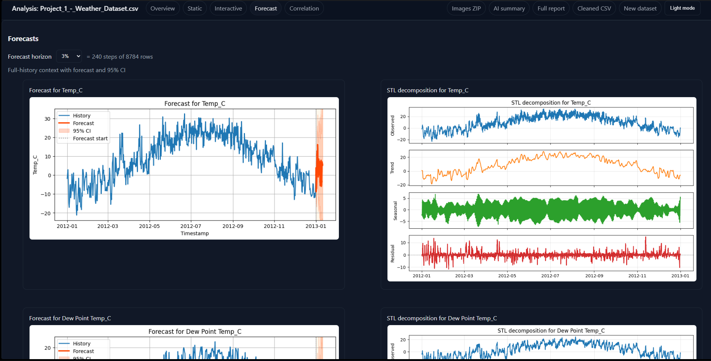
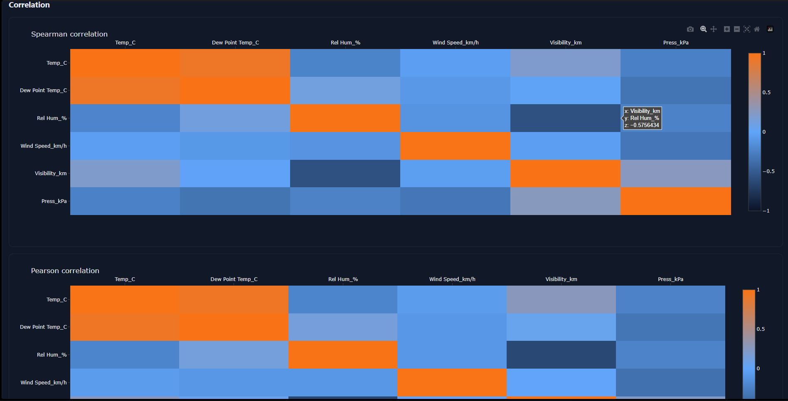

<div align="center">

# Data Analysis & AI Insight Platform

Multi‑format exploratory data analysis, statistical insights, anomaly & trend detection and Gemini‑powered narrative summaries – all in a single lightweight Flask app.

</div>

## 1. Overview
This project started as a quick way to upload sensor or tabular datasets (CSV, Excel, TXT, JSON) and get fast, readable analysis. It has evolved into a modular data insight tool with AI summaries, question answering, forecasting visuals, decomposition plots, correlation exploration and performance-aware caching. The app now uses a package layout under `data_analysis/` while keeping `app.py` as a backward-compatible entrypoint.

### Upload Interface
<div align="center">
  
  <p><em>Clean, intuitive upload interface with configurable analysis options</em></p>
</div>

## 2. Key Features (Current State)

### Visual Overview

<div align="center">
  
  <p><em>Comprehensive AI-generated narrative analysis with structured insights</em></p>
</div>

<div align="center">
  
  <p><em>Context-aware question answering powered by Gemini AI</em></p>
</div>

<div align="center">
  
  <p><em>High-quality Matplotlib visualizations with trend analysis</em></p>
</div>

<div align="center">
  
  <p><em>Interactive Plotly charts for deeper data exploration</em></p>
</div>

<div align="center">
  
  <p><em>Time series forecasting with confidence intervals and STL decomposition</em></p>
</div>

<div align="center">
  
  <p><em>Correlation heatmaps with both Spearman and Pearson methods</em></p>
</div>


### Implemented Features
Implemented:
- File upload & persistent session dataset registry (multiple datasets retained per run)
- Automatic schema parsing & numeric coercion with graceful fallbacks
- Descriptive statistics (central tendency, dispersion inferred types)
- Time series handling: thinning/downsampling for large datasets to keep responsiveness
- Static Matplotlib plots serialized as base64 images (no JS dependency required)
- Forecast visual (statsmodels based) & STL decomposition plot generation
- Correlation / pairwise exploration (optimized payload normalization)
- AI Summary: Gemini API generates a multi‑section narrative (status: improving reliability on free tier)
- AI Q&A: ask contextual questions about the currently analyzed dataset (includes caching to reduce rate pressure)
- Offline fallback summaries when AI unavailable, with inline reason display (e.g. rate limit, empty response, unsupported MIME type)
- Model selection & adaptive fallback to free‑tier eligible Gemini models (auto downgrades when a model has no free quota)
- Rate limit aware backoff & error reason surfacing in UI
- Security headers & basic hardening via `Flask-Talisman`
- Application level rate limiting via `Flask-Limiter`
- Environment isolation via `.env` (secret key & API key **not** committed)
- Check script (`check_models.py`) that enumerates free-tier models with a strength ordering & published limit snapshot
- Logging to `app.log` with AI diagnostic context

In Progress / Recent Focus:
- Making AI summary generation more verbose while staying within free-tier token ceilings
- Reducing “Empty AI response (finish_reason=MAX_TOKENS)” by tuning prompt size vs allowed output tokens
- Further UI polish & optional interactive Plotly expansion (currently using static images for performance)

Planned / Roadmap Ideas:
- Configurable analysis presets (light, standard, deep)
- Optional asynchronous job queue for very large datasets
- Export selectable sections to Markdown / JSON (PDF code removed for now to reduce dependency overhead)
- Lightweight user settings (preferred model, verbosity)
- Automated test coverage expansion (currently minimal)

## 3. Tech Stack
- **Backend**: Flask (modular package + compatibility facade)
- **Data**: pandas, numpy, statsmodels, scikit-learn (select features)
- **Plots**: Matplotlib (static PNG via base64)
- **AI**: `google-generativeai` (Gemini models) with adaptive free-tier fallback
- **Security**: Flask-Talisman, Flask-Limiter
- **Environment**: `python-dotenv`
- **Dev Tooling**: `ruff`, `mypy`, `pytest`

## 4. Architecture Snapshot
Core logic is split across `data_analysis/`:
- `data_analysis/core/`: configuration, logging, cache/state primitives, lazy imports
- `data_analysis/ai/`: Gemini service integration + HTML/text formatting helpers
- `data_analysis/analysis/`: forecasting, plotting, anomaly detection, DataFrame operations, AI context builders
- `data_analysis/routes/`: upload, analysis, API, and download route handlers
- `data_analysis/reports/`: PDF report classes/handlers
- `data_analysis/legacy_app.py`: compatibility runtime used during incremental extraction
- `app.py`: thin facade preserving legacy import and startup behavior

Behavior highlights:
- Upload endpoint stores the parsed DataFrame in an in‑memory cache (LRU)
- Analysis route branches views (overview / forecast / decomposition / correlation)
- AI helpers build a trimmed context (column stats, head/tail detected anomalies) before sending to Gemini
- Caching layers: DataFrame cache, AI summary (only if a genuine AI result) AI Q&A answer cache
- Rate errors trigger adaptive model fallback (e.g. from a higher capability model to `gemini-2.5-flash` or below)

## 5. Supported File Types
| Type | Extensions | Notes |
|------|------------|-------|
| CSV | `.csv` | Auto detects encoding where possible |
| Excel | `.xlsx` | Uses `openpyxl` |
| Text (delimited) | `.txt` | Heuristics attempt comma / tab split |
| JSON (records / list) | `.json` | Flattens list of objects |

## 6. AI Integration & Free Tier Constraints
The Gemini free tier imposes limits on Requests/Minute (RPM), Tokens/Minute (TPM), and Requests/Day (RPD). The app:
- Tries a preferred model (by strength) and falls back when quota or entitlement errors occur
- Surfaces exact failure reason in the UI (e.g. “model has no free quota tier” / “empty AI response”)
- Avoids caching offline placeholders so a later retry can succeed
- Downscales prompt size dynamically (work in progress) to avoid `MAX_TOKENS` premature stops

A snapshot of documented free-tier limits (as of 2025‑08‑26 – see docs for updates):
- `gemini-2.5-pro`: RPM 5, TPM 250k, RPD 100
- `gemini-2.5-flash`: RPM 10, TPM 250k, RPD 250
- `gemini-2.5-flash-lite`: RPM 15, TPM 250k, RPD 1000
- `gemini-2.0-flash`: RPM 15, TPM 1M, RPD 200
- `gemini-2.0-flash-lite`: RPM 30, TPM 1M, RPD 200

Check live availability & mapping via:
```powershell
python check_models.py
```

## 7. Performance Optimizations Implemented
- Downsampling long time series before plotting
- Narrowed numeric coercion & column profiling to necessary subsets
- Removed heavyweight PDF export dependencies
- Short‑circuit repeated expensive AI calls with caching
- Lazy AI model initialization (only when first needed)
- Normalized model naming to avoid redundant instantiations

## 8. Setup & Running Locally
Prerequisites: Python 3.11+ recommended.

```powershell
python -m venv venv
./venv/Scripts/Activate.ps1
pip install -r requirements.txt
```

Create a `.env` file (not committed) with:
```
FLASK_ENV=development
GOOGLE_API_KEY=your_real_key_here
SECRET_KEY=some_random_string
```

Run the app:
```powershell
python app.py
```
Then open the printed local URL (typically `http://127.0.0.1:5000`).

## 9. Project Scripts
| Script | Purpose |
|--------|---------|
| `check_models.py` | Lists free‑tier Gemini models, strength‑sorted, with rate limit snapshot |

## 10. VS Code Workflow (Rules + Hooks + Plans)

This repository now includes a lightweight VS Code workflow to improve consistency and task context.

- Rules/context for Copilot:
  - `.github/copilot-instructions.md`
- Reusable planning prompt:
  - `.github/prompts/plan-and-execute.prompt.md`
- VS Code tasks/debug profiles:
  - `.vscode/tasks.json`
  - `.vscode/launch.json`
  - `.vscode/settings.json`
- Git quality hooks:
  - `.githooks/pre-commit`
  - `.githooks/pre-push`

### Enable hooks once per clone

```powershell
git config core.hooksPath .githooks
```

Or run VS Code task: **Install Git Hooks**.

### Common VS Code tasks

- **Lint (ruff)**
- **Type Check (mypy)**
- **Test (pytest)**
- **Validate Project** (runs lint + types + tests in order)
- **Run Flask App**

## 11. Environment & Configuration Notes
- Don’t expose the API key in `.env.public` – keep it only in `.env` / deployment secret store.
- Adjust rate limit strategies (window sizes) via environment if needed (future enhancement).

## 12. Logging & Troubleshooting
- Runtime logs: `app.log`
- AI issues: look for lines containing `AI status`, `rate limit`, or `Empty AI response`
- Common scenarios:
	- `Empty AI response (finish_reason=MAX_TOKENS)`: Increase output token allowance or trim prompt
	- `429 ... no free quota tier`: Model not available on free tier – auto fallback should occur
	- `Unsupported MIME type`: Resolved by coercing to `text/plain`

## 13. Testing (Initial)
Minimal automated tests exist; expansion planned. Suggested next steps:
- Add unit tests for model fallback decision logic
- Add prompt size regulator tests
- Add regression tests for large CSV ingestion

## 14. Security Considerations
- HTTP security headers via Talisman (CSP etc.)
- Rate limiting reduces brute force / abuse surface
- No file persistence beyond in‑memory caches (ephemeral session state)
- Future: file type stricter validation & sandboxing for untrusted content

## 15. Roadmap (Condensed)
- Robust prompt size manager (token budgeting)
- Optional job queue for long-running decomposition/forecast tasks
- Export to structured Markdown/JSON summaries
- Incremental analysis refresh instead of full recompute
- Dark mode & lightweight front-end enhancements

## 16. Contributing
Currently focused on rapid iteration. If you want to contribute:
1. Fork & branch
2. Keep changes focused
3. Open a PR with a short rationale & before/after impact

## 17. License
License not yet specified (TBD). Add a `LICENSE` file before wider distribution.

## 18. Disclaimer
AI output is heuristic and may contain inaccuracies. Validate critical insights with domain/statistical review.

---
Questions or ideas? Open an issue or extend the roadmap section – iterative refinement is the guiding principle here.
