# 📊 Data Analysis & AI Insight Platform

A Flask-based data analysis workspace for uploading real datasets, exploring them through multiple analysis tabs, exporting artifacts, and using AI-assisted narrative summaries when Gemini quota is available.

## What this project does right now

- Upload and analyze **CSV / Excel / JSON / TXT** datasets.
- Generate analysis across dedicated views:
  - **Overview**
  - **Interactive**
  - **Detailed Analysis (forecast-focused)**
  - **Correlation**
  - **Categories**
- Provide export actions directly from the UI:
  - cleaned CSV
  - AI summary HTML
  - static plots ZIP
  - full report HTML
  - full report PDF
- Support **three UI themes**: AMOLED, Light, Dark.
- Offer a restored **Research Labs hub** with pages for:
  - Forecast
  - Anomaly
  - Quality
  - Change Points
  - Conformal
  - SHAP
  - Multivariate

---

## 🖼️ Current UI gallery (captured April 2026)

All screenshots below were captured from the current app using datasets in `datasets/`:

- `datasets/Project 1 - Weather Dataset.csv`
- `datasets/Life Expectancy Data.csv`

### Default visual style (AMOLED-first)

| Upload (AMOLED) |
|---|
|  |

### Theme showcase (Light / Dark)

| Light | Dark |
|---|---|
| 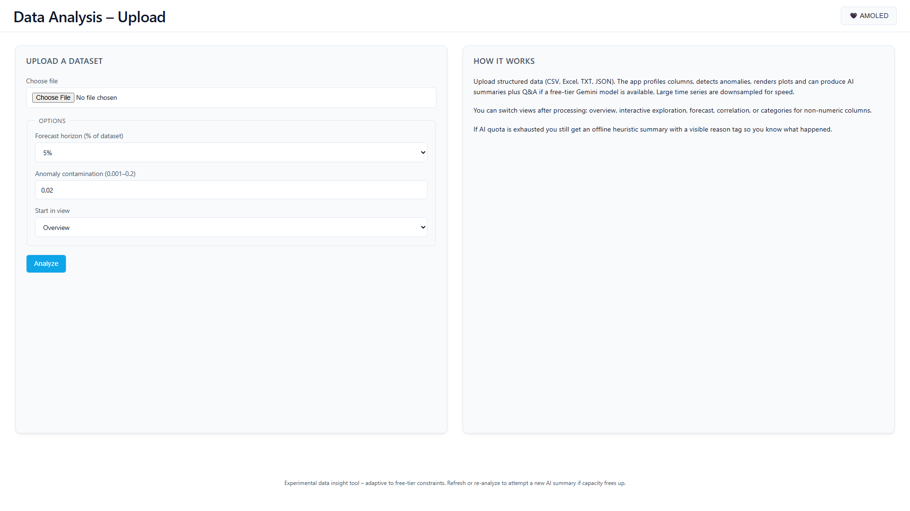 | 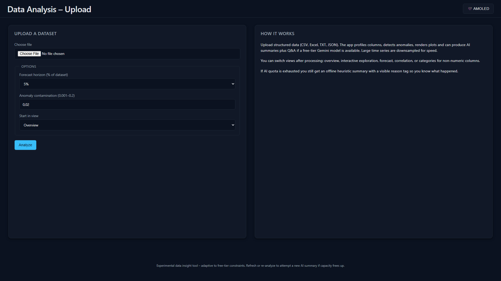 |

### Analysis tabs (Weather dataset)

| View | Screenshot |
|---|---|
| Overview (AMOLED) | 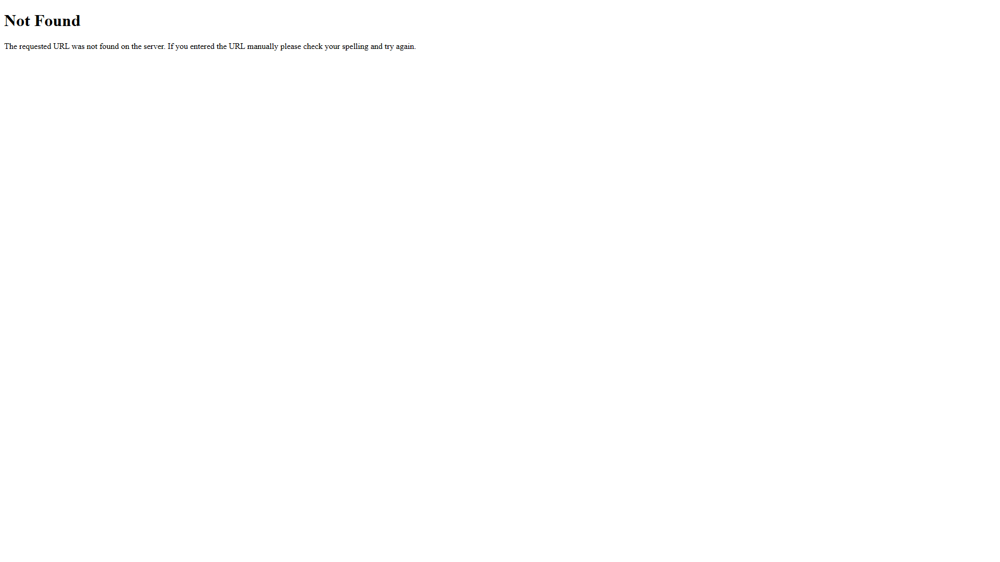 |
| Interactive (AMOLED) | 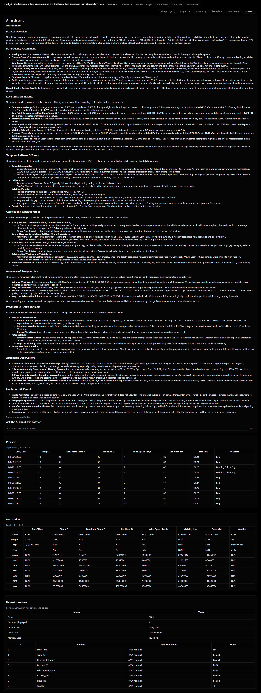 |
| Detailed Analysis (AMOLED) | 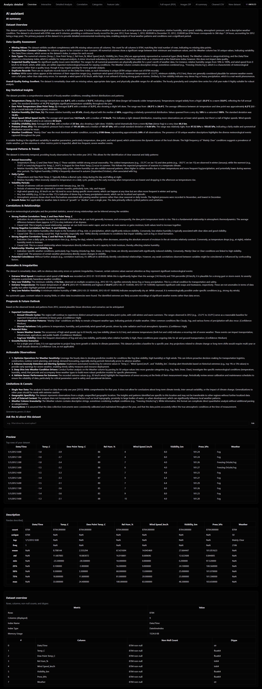 |
| Correlation (AMOLED) | 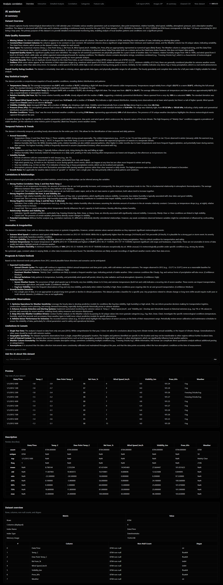 |
| Categories (AMOLED) | 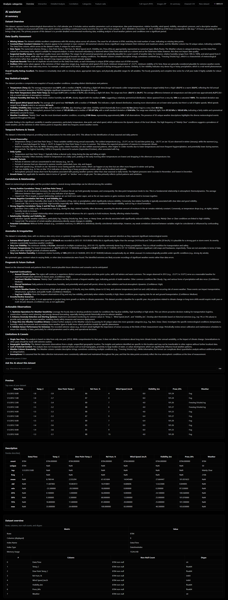 |

> ✅ Categories behavior update: the active temporal-axis column is now filtered out of category charts to avoid self-count temporal noise.

### Research Labs pages (Weather dataset)

| Page | Screenshot |
|---|---|
| Labs Hub (AMOLED) | 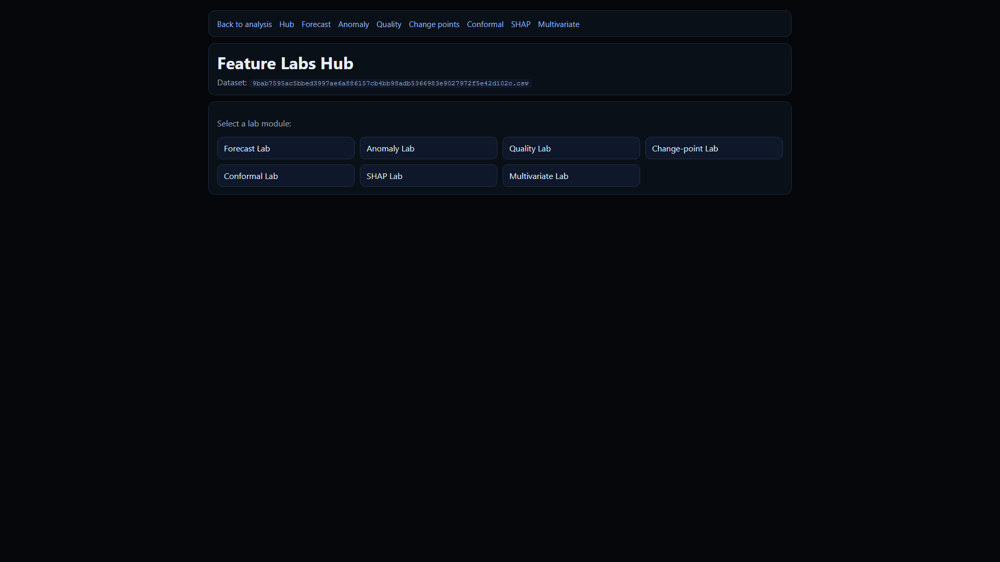 |
| Forecast Lab (AMOLED) |  |
| Anomaly Lab (AMOLED) |  |
| Quality Lab (AMOLED) |  |
| Change Points Lab (AMOLED) |  |
| Conformal Lab (AMOLED) |  |
| SHAP Lab (AMOLED) | 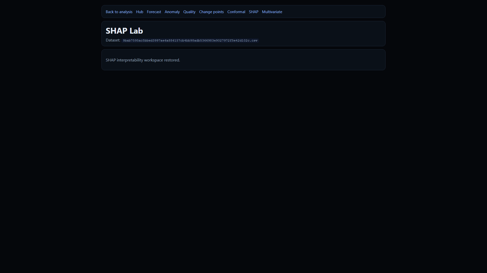 |
| Multivariate Lab (AMOLED) | 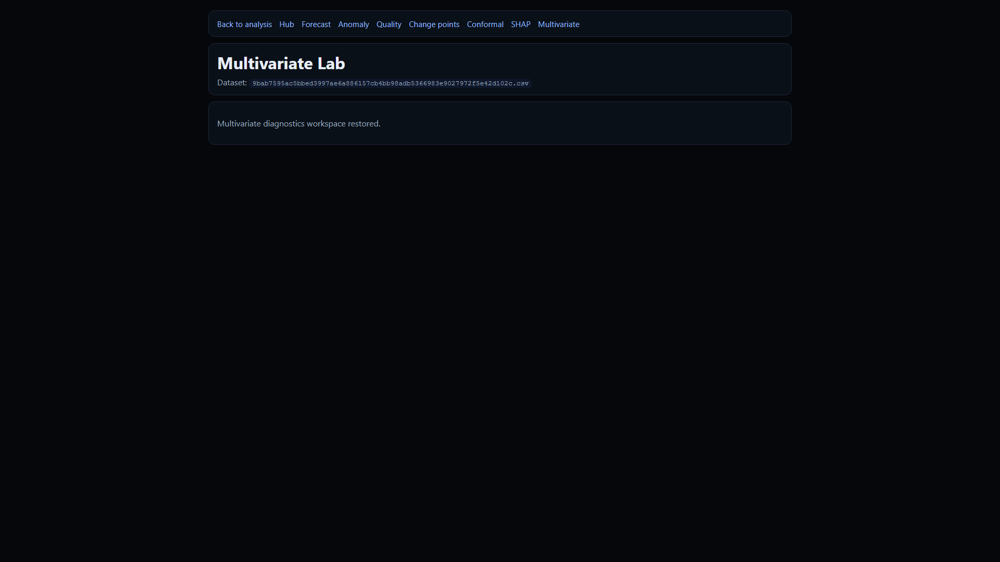 |

### Additional dataset scenario (Life Expectancy)

| View | Screenshot |
|---|---|
| Overview (AMOLED) | 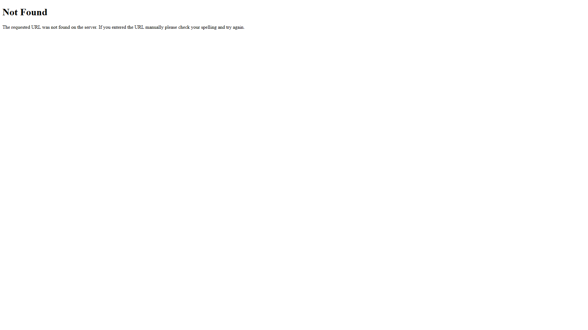 |
| Interactive (AMOLED) | 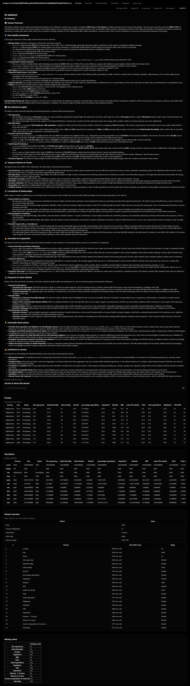 |
| Detailed Analysis (AMOLED) | 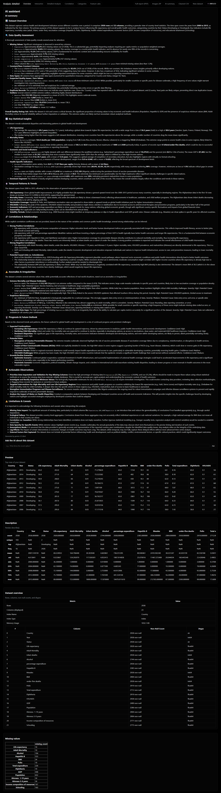 |
| Correlation (AMOLED) | 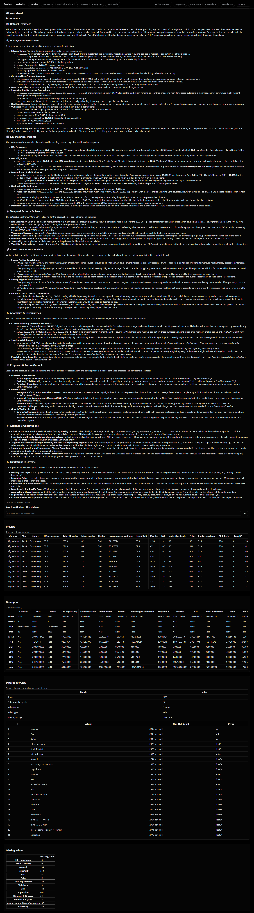 |
| Categories (AMOLED) | 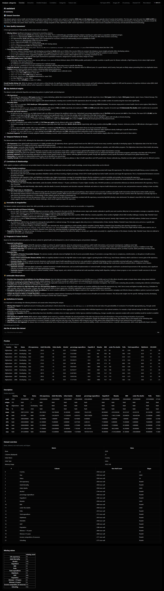 |
| Labs Hub (AMOLED) |  |

---

## ✅ Current capabilities (implemented)

### Data ingestion and preparation
- Upload pipeline with hashed filenames and session-aware caching.
- Supported extensions: `.csv`, `.xlsx`, `.xls`, `.json`, `.txt`.
- Numeric coercion and missing-value profiling.
- Datetime inference for temporal plotting.

### Analysis views
- **Overview**: table preview, summary stats, missing values, AI panel.
- **Interactive**: Plotly history/anomaly/forecast overlays and distributions.
- **Detailed Analysis**: static plots per column including trend/distribution/forecast and STL (when applicable).
- **Correlation**: Spearman/Pearson matrix and heatmaps.
- **Categories**: categorical frequency charts for non-numeric columns, excluding the active temporal axis column.

### Export and reporting
- `download cleaned CSV`
- `download AI summary HTML`
- `download static plots ZIP`
- `download full report HTML`
- `download full report PDF`

### AI integration
- Gemini-backed dataset summaries and Q&A when available.
- Model fallback and cache-aware behavior.
- Graceful degraded/offline messaging when AI is unavailable.

### Runtime safety and performance
- Talisman security headers and limiter integration.
- Local caching for expensive computations (numeric transforms, anomalies, correlation, heatmaps, forecasts).
- Downsampling-aware interactive handling for large datasets.

---

## 🚧 Work in progress

The project currently has active ongoing work in these areas:

- **Research labs depth**: lab pages are restored and navigable, with incremental backend depth being expanded across advanced methods.
- **AI prompt/runtime robustness**: improving long-summary reliability, quota-aware fallbacks, and response quality consistency.
- **UI/UX iteration**: refining layout density, theme consistency, and per-view ergonomics for large datasets.
- **Export consistency improvements**: ongoing harmonization between on-page charts and ZIP/PDF outputs.

---

## 🚀 Future advancements

Planned evolution areas include:

- richer advanced analytics in labs (e.g., more robust explainability and uncertainty pipelines),
- stronger asynchronous processing for very large datasets,
- enhanced multi-dataset comparative workflows,
- expanded report customization and selective export packs,
- optional user preferences/profile persistence and API-oriented workflows.

---

## 🛠️ Tech stack

- **Backend**: Flask, Python 3.11+
- **Data**: pandas, numpy, statsmodels, scikit-learn
- **Visualization**: matplotlib, plotly
- **AI**: Google Gemini integration
- **Quality**: pytest, ruff, mypy

---

## 🚀 Quick start

1. Create and activate a virtual environment.
2. Install dependencies from `requirements.txt`.
3. Create `.env` (already gitignored) and add secrets if AI features are needed.
4. Run the app with `.venv\Scripts\python app.py` (Windows) or `python app.py` (if activated).
5. Open `http://127.0.0.1:5000`.

Sample datasets are available under `datasets/`.

---

## 💻 Development checks

- Lint: `.venv\Scripts\python -m ruff check .`
- Type check: `.venv\Scripts\python -m mypy app.py check_models.py`
- Tests: `.venv\Scripts\python -m pytest -q tests`

VS Code tasks for these checks are already configured.

---

## 🧪 Notes on screenshot refresh

This README has been updated to reflect current routes/pages/themes and to include a broad capture set for:

- all main analysis views,
- all lab pages,
- multiple themes,
- multiple real datasets from the repository.

---

## ⚠️ Disclaimer

AI output is assistive and may be imperfect. For high-stakes decisions, validate conclusions with domain and statistical review.
